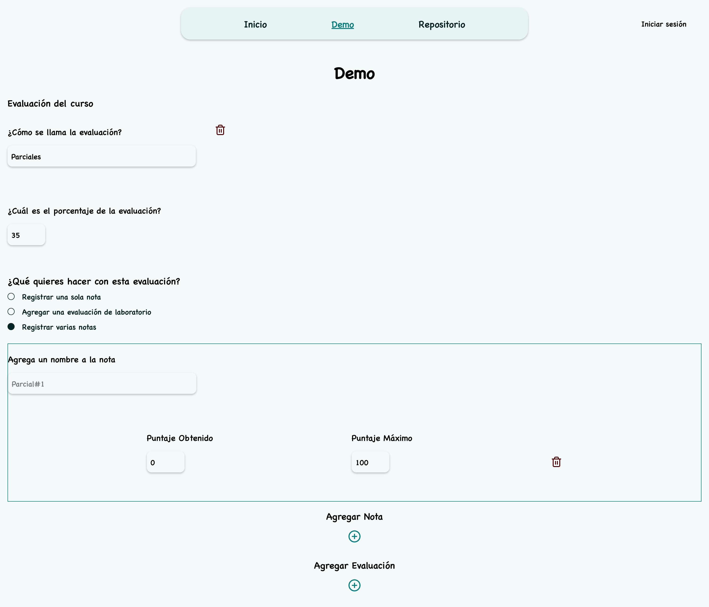
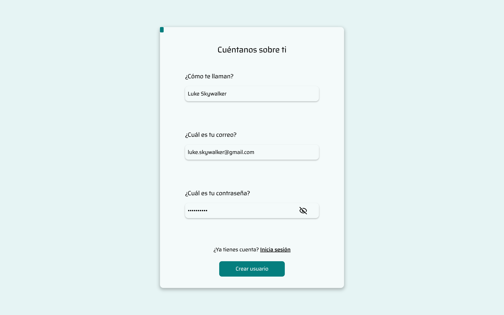
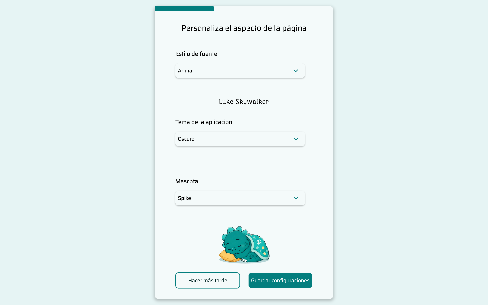
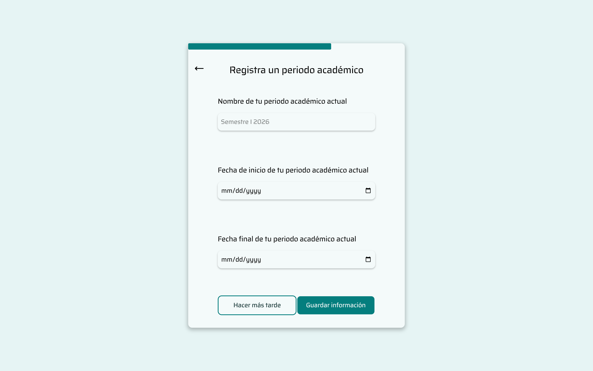
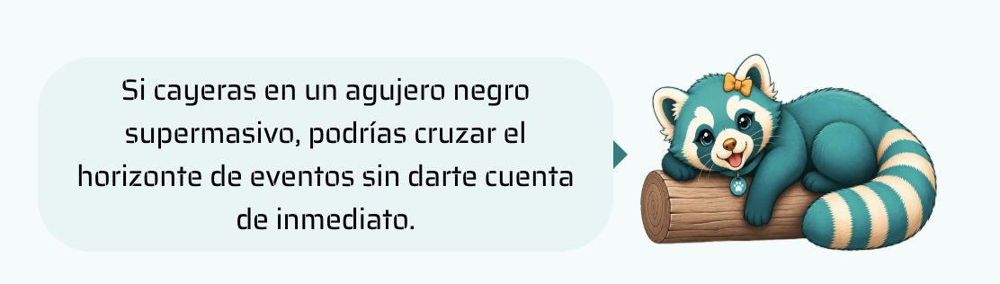
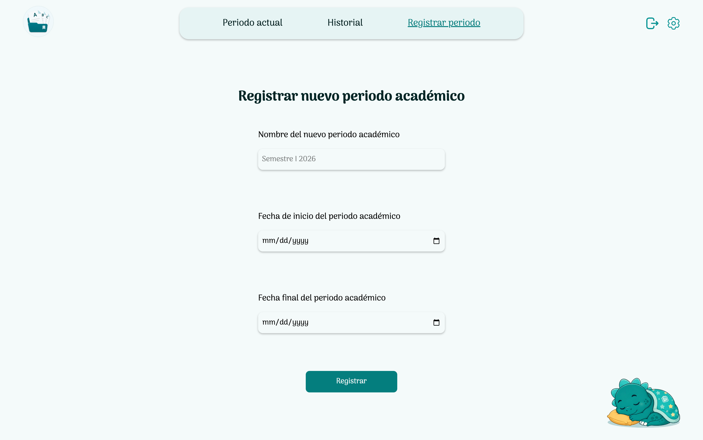
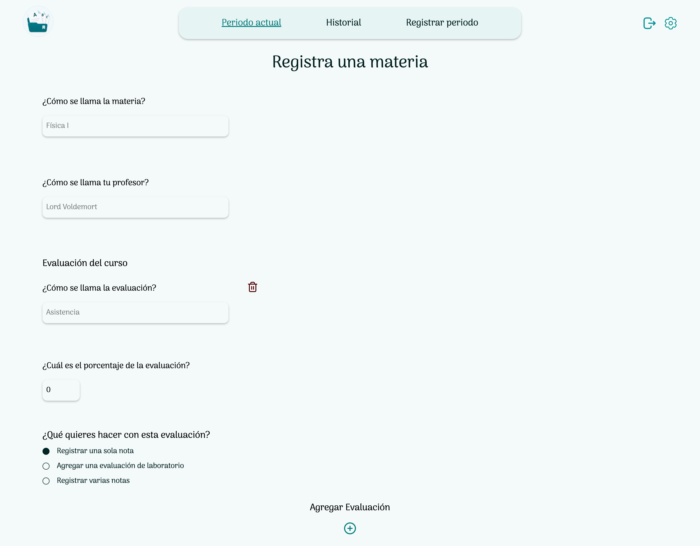
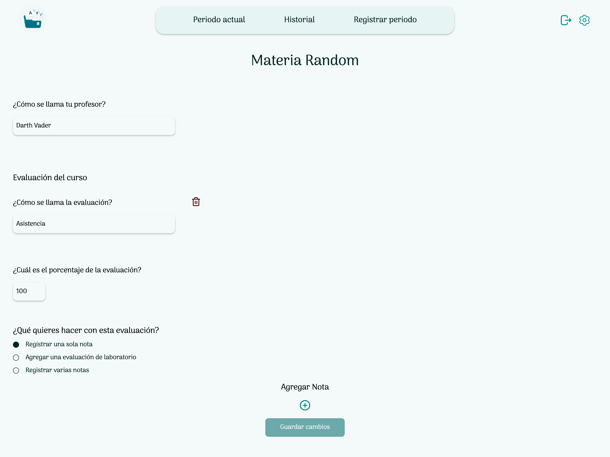
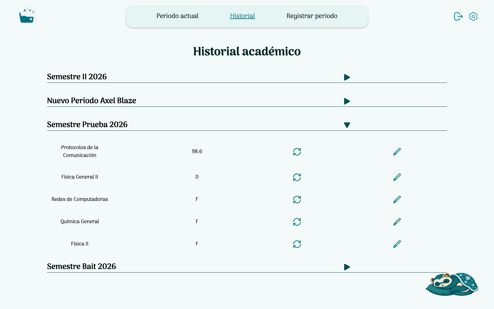
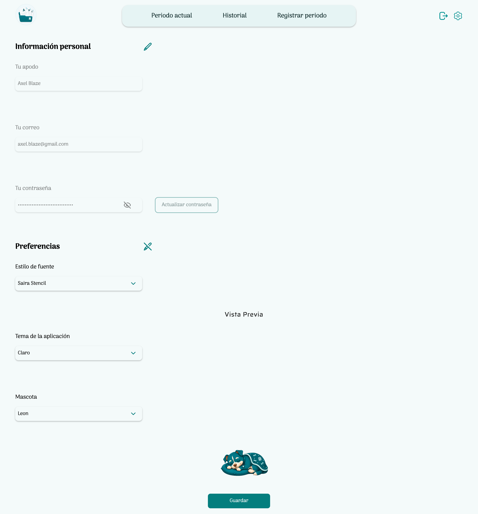

# Notas Universitarias


## Table of Content
--- 
- [Description](#description)
- [Tech Stack](#tech-stack)
- [Prerequisites](#prerequisites)
- [Installation](#installation) 
- [Features](#features) 
- [Roadmap](#roadmap)  
- [Updates](#updates)

## Description
--- 
Notas Universitarias aims to provide a platform for university students to organize their courses, register their evaluations, and track their academic performance throughout each academic period.

## Tech Stack
--- 
### Language
1. TypeScript

### Shared Tools
1. Zod
### Frontend
1. React con Tanstack Start
2. Tanstack Form 
3. Tanstack Query
### Backend
1. Hono
2. MongoDB
### Infrastructure
1. Docker
2. Docker Compose

## Prerequisites
---
1. A Chromium-based web browser (Google Chrome, Microsoft Edge, Brave, etc.)
2. Git
3. Docker Desktop (On Windows, it is recommended to use Docker Desktop with WSL 2 enabled.)

## Installation
---

#### Steps
1. Open your terminal and clone the repository:
	```git
	git clone https://github.com/Emilianovich/notas-universitarias.git
	```
	También puedes descargar el ZIP de la rama **master**.

2. The following command starts the required services:
- Web Application
- Backend API
- MongoDB Database
	```bash
	docker compose -f docker/release/compose.release.yml up --build
	```
	Run it from the root directory of the repository.
	

2. Open a browser and navigate to: http://localhost:3987
*If you encounter a problem, it is probably because another process is running on one of the following ports: `3035`, `3987`, `27017`. Terminate those processes and return to step 2*
### Features
#### 1. Demo
Allows users to quickly calculate a grade without needing to create an account.


#### 2. Account Creation
Users can create an account to keep track of their grades over time across different courses.
During registration, users can optionally configure application preferences such as theme, font, and pet.
  
#### 3. Interactive Pet
Throughout your experience, you can choose between different pets: Spike, Nita, León, Mila, and Tom.
By interacting with them, they will share interesting facts about different topics.


#### 4. Create an Academic Period
You can register an academic period with:
1. A name of your preference
2. Start date
3. End date



#### 5. Add a Course to an Academic Period
You can create a course structure by specifying:
1. Course name
2. Professor's name


#### 6. Update Course Information
Course percentages may change throughout an academic period as professors assign exams, projects, and other evaluations.
The application allows you to update course information as the academic period progresses.
The course structure includes:
1. Course name
2. Professor's name
3. How the course is divided percentage-wise


#### 7. Academic History
Once an academic period ends, you can review your performance.
Additionally, since grade appeals may occur after the academic period ends, you can still edit your grades afterwards.


#### 8. Settings
You can modify your personal information and application preferences whenever you want.


## Roadmap
--- 
This is only the first version of the project, and several features are not currently available but will be added in future updates. Future improvements include:
### Look and Feel
- Dark mode
- Performance tables
- Illustrative charts showing the percentages obtained in a course

### Organization
- Add notes to courses
- Delete courses
### More customizations
- Greater pet customization
- More configuration options


## Updates
---
To receive updates, follow these steps:

1. Pull the latest changes from the master branch by running `git pull` from the repository root directory.:

2. From the root directory, rebuild the containers by running:

```bash
docker compose -f docker/release/compose.release.yml up --build
```

If you want to receive these updates, you need to clone the repository instead of simply downloading the **ZIP** file from the master branch.
	